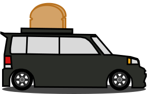
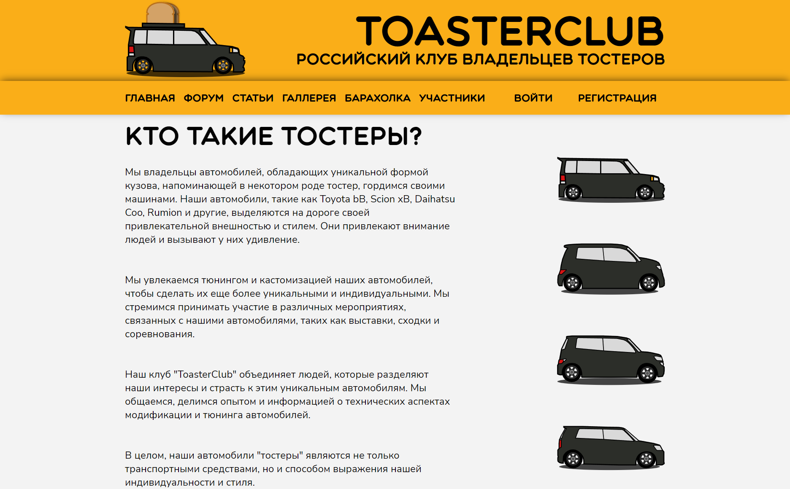

# ToasterClub on Laravel 11


The backend is building  on API using Laravel



## Installation

Clone the repo locally:

```sh
git clone https://github.com/MrSmileGod23/ToasterClub.git
cd ToasterClub
```

Install PHP dependencies:

```sh
composer install
```

Install NPM dependencies:

```sh
npm install
```

Build assets:

```sh
npm run dev
```

Setup configuration:

```sh
cp .env.example .env
```

Generate application key:

```sh
php artisan key:generate
```

Create an SQLite database. You can also use another database (MySQL, Postgres), simply update your configuration accordingly.

```sh
touch database/database.sqlite
```

Run database migrations:

```sh
php artisan migrate
```

Run database seeder:

```sh
php artisan db:seed
```

Run artisan storage:

```sh
php artisan storage:link
```

Run artisan server:

```sh
php artisan serve
```

You're ready to go! [Toaster Club](http://127.0.0.1:8000/) in your browser!
